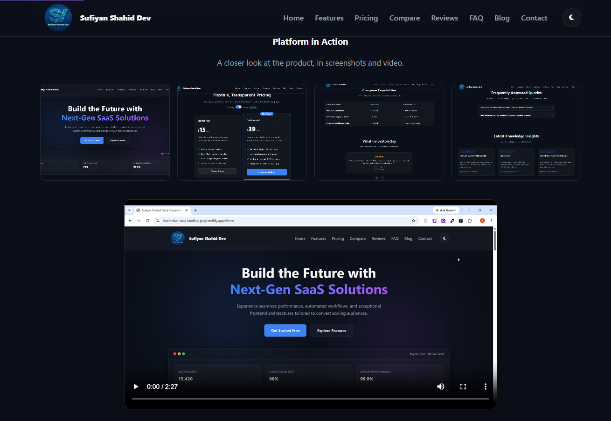
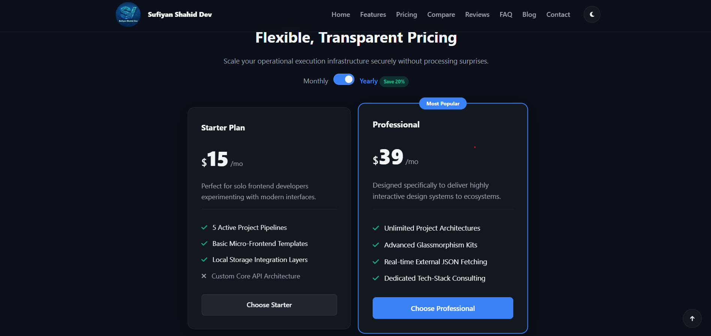
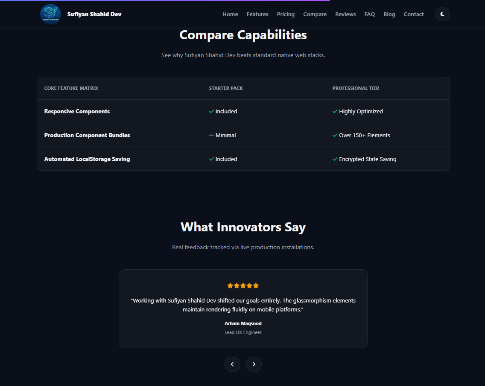
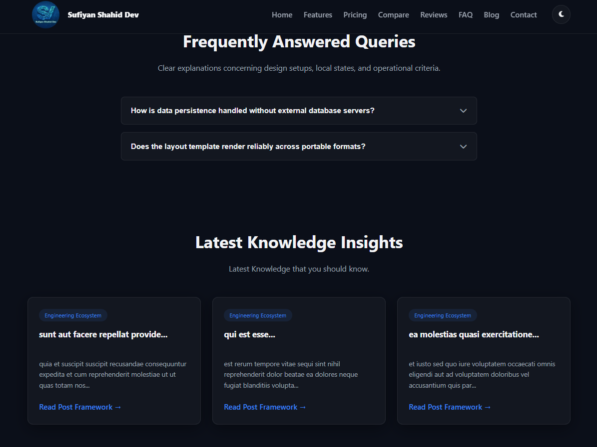
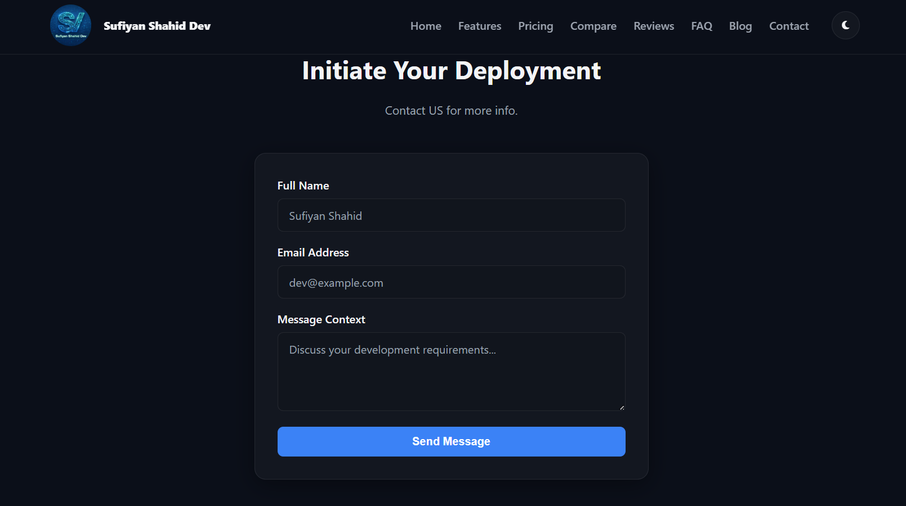
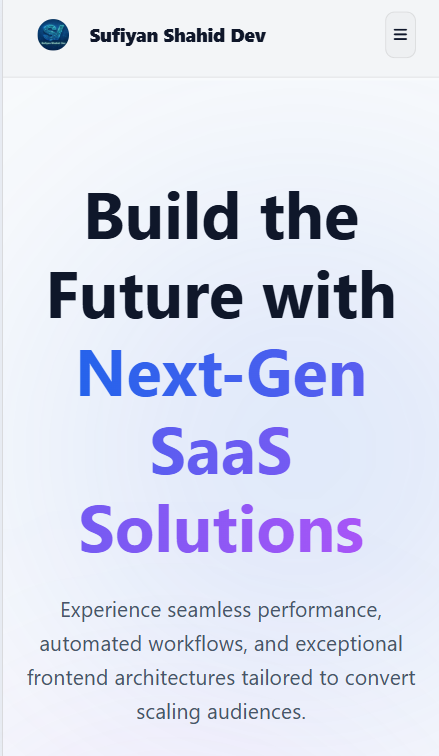
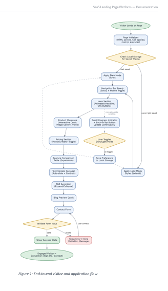

# Interactive SaaS Landing Page & Product Experience Platform

> A fully responsive, framework-free SaaS landing page — built with nothing but HTML, CSS, JavaScript, and Local Storage.


---

## Why this project?

Most landing pages lean on Bootstrap or a JS framework to get interactivity for free. This one doesn't. Every animation, every toggle, every carousel, every accordion — it's all hand-written, plain JavaScript, no dependencies. The goal was simple: prove that a vanilla frontend can look and feel just as polished as a framework-powered one, while staying lighter, faster, and fully under your control.

The result is an immersive, conversion-focused SaaS site: hero → product proof → pricing → social proof → contact, with dark/light mode, smooth animations, and a layout that holds up on everything from a 27" monitor to a phone in your pocket.

---

## ✨ Features

### 🎯 Hero Section
Animated headline, clear call-to-action buttons, and a product preview that greets every visitor with intent — not a wall of text.


### 🧩 Product Showcase
An interactive card grid with hover animations, an image gallery, and an embedded video preview — so visitors *see* the product instead of just reading about it.



### 💰 Pricing Section
A monthly/yearly toggle that recalculates prices instantly, no page reload, with the most popular plan visually highlighted.



### 📊 Feature Comparison
A clean, scannable table with icons and visual indicators so it's obvious at a glance what each plan includes.

### 💬 Customer Testimonials
An auto-sliding carousel with star ratings and manual navigation controls, because social proof works.



### ❓ FAQ Section
Accordion-style questions with smooth expand/collapse animation — only one answer open at a time, so it stays tidy.

### 📰 Blog Preview
Featured article cards with category tags, keeping visitors engaged with the brand beyond the product itself.



### 📬 Contact Section
A validated contact form with real inline error messages and clear success/error states — not just a form that silently does nothing.



### ⚡ Interactive Components (everywhere)
- 🌗 Dark/Light mode — saved to Local Storage, remembered on your next visit
- ⬆️ Back-to-top button
- 📌 Sticky navigation bar
- 📈 Scroll progress indicator
- 🔢 Animated counters that count up when they scroll into view

### 📱 Fully Responsive
Tested and tuned across desktop, laptop, tablet, and mobile — no broken grids, no horizontal scroll, no excuses.



---

## 🏗️ How it's built

No frameworks. No Bootstrap. No build step required to run it.

| Layer | What it does |
|---|---|
| **HTML** | Semantic structure for every section, using plain tags and custom classes |
| **CSS** | Layout, responsive breakpoints, theming, transitions, and animations via Flexbox, Grid, and CSS custom properties |
| **JavaScript (vanilla)** | Every interactive behavior — navigation, carousels, accordions, form validation, counters, scroll effects, theme switching |
| **Local Storage** | Remembers the visitor's dark/light mode preference between visits |


### Project Flow

The diagram below shows how a visitor moves through the page, alongside the background logic that runs alongside it (theme detection, scroll tracking, form validation).

<!-- Screenshot / diagram: project flow chart -->


---

## 📁 Folder Structure

```
├── index.html          
├── style.css                 
├── app,js                  
│                         
├── assets/
│   ├── images/          
│   └── video/           
└── └── readme-assets/           
       
```

## 🌐 Browser Support

Built and tested on modern evergreen browsers — Chrome, Edge, Firefox, and Safari — using standard, well-supported CSS and JavaScript APIs. No polyfills required.

---

## 🎯 What this project demonstrates

- Component-style thinking without a component framework
- Real accessibility work, not just default framework behavior
- Hand-rolled animations that stay smooth because they run on CSS, not JS loops
- A responsive system that actually holds up across screen sizes
- That Local Storage alone is enough to make a static site feel personalized

---

<p align="center">Built with HTML, CSS, and JavaScript.</p>