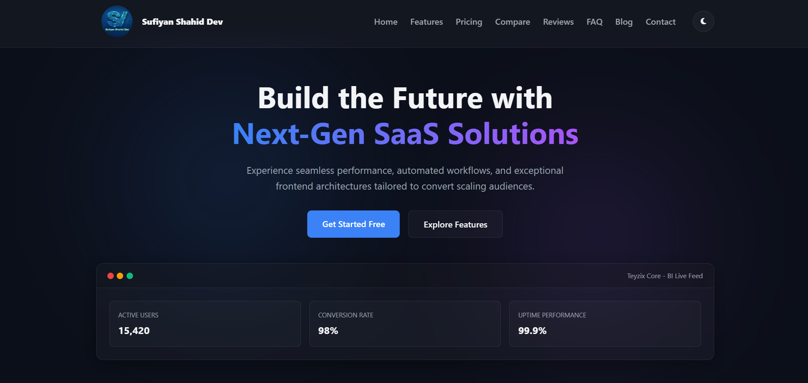

# Interactive SaaS Landing Page & Product Experience Platform

> A fully responsive, framework-free SaaS landing page — built with nothing but HTML, CSS, JavaScript, and Local Storage.

<!-- 🖼️ HERO SCREENSHOT — drop your image at ./screenshots/hero.png and this will show automatically -->


---

## Why this project exists

Most landing pages lean on Bootstrap or a JS framework to get interactivity for free. This one doesn't. Every animation, every toggle, every carousel, every accordion — it's all hand-written, plain JavaScript, no dependencies. The goal was simple: prove that a vanilla frontend can look and feel just as polished as a framework-powered one, while staying lighter, faster, and fully under your control.

The result is an immersive, conversion-focused SaaS site: hero → product proof → pricing → social proof → contact, with dark/light mode, smooth animations, and a layout that holds up on everything from a 27" monitor to a phone in your pocket.

---

## ✨ Features

### 🎯 Hero Section
Animated headline, clear call-to-action buttons, and a product preview that greets every visitor with intent — not a wall of text.

<!-- Screenshot: hero section close-up -->


### 🧩 Product Showcase
An interactive card grid with hover animations, an image gallery, and an embedded video preview — so visitors *see* the product instead of just reading about it.

<!-- Screenshot: product showcase -->


### 💰 Pricing Section
A monthly/yearly toggle that recalculates prices instantly, no page reload, with the most popular plan visually highlighted.

<!-- Screenshot: pricing toggle -->


### 📊 Feature Comparison
A clean, scannable table with icons and visual indicators so it's obvious at a glance what each plan includes.

### 💬 Customer Testimonials
An auto-sliding carousel with star ratings and manual navigation controls, because social proof works.

<!-- Screenshot: testimonials + comparison table -->


### ❓ FAQ Section
Accordion-style questions with smooth expand/collapse animation — only one answer open at a time, so it stays tidy.

### 📰 Blog Preview
Featured article cards with category tags, keeping visitors engaged with the brand beyond the product itself.

<!-- Screenshot: FAQ + blog preview -->


### 📬 Contact Section
A validated contact form with real inline error messages and clear success/error states — not just a form that silently does nothing.

<!-- Screenshot: contact form success state -->


### ⚡ Interactive Components (everywhere)
- 🌗 Dark/Light mode — saved to Local Storage, remembered on your next visit
- ⬆️ Back-to-top button
- 📌 Sticky navigation bar
- 📈 Scroll progress indicator
- 🔢 Animated counters that count up when they scroll into view

### 📱 Fully Responsive
Tested and tuned across desktop, laptop, tablet, and mobile — no broken grids, no horizontal scroll, no excuses.

<!-- Screenshot: side-by-side desktop vs mobile -->


---

## 🏗️ How it's built

No frameworks. No Bootstrap. No build step required to run it.

| Layer | What it does |
|---|---|
| **HTML** | Semantic structure for every section, using plain tags and custom classes |
| **CSS** | Layout, responsive breakpoints, theming, transitions, and animations via Flexbox, Grid, and CSS custom properties |
| **JavaScript (vanilla)** | Every interactive behavior — navigation, carousels, accordions, form validation, counters, scroll effects, theme switching |
| **Local Storage** | Remembers the visitor's dark/light mode preference between visits |

A quick note on **why Bootstrap was removed**: the project originally used Bootstrap-style markup, but every Bootstrap-specific attribute and class was stripped out and rebuilt in vanilla JS — mainly to get full control over accessibility. All `aria-*`, `role`, and `data-*` attributes that Bootstrap would normally manage are now handled manually, kept in sync with each component's state through plain event listeners and class toggling. Same goes for the mobile navigation menu — no Bootstrap Collapse plugin under the hood, just a small script that manages open/close state and focus itself.

### Project Flow

The diagram below shows how a visitor moves through the page, alongside the background logic that runs alongside it (theme detection, scroll tracking, form validation).

<!-- Screenshot / diagram: project flow chart -->


---

## 📁 Folder Structure

```
├── index.html          # Single-page entry point — all sections live here
├── css/                 # Base styles, layout, components, theme variables
├── js/                  # One concern per file: nav, theme toggle, carousel,
│                         #   accordion, form validation, counters
├── assets/
│   ├── images/          # Hero, gallery, and blog images
│   └── video/           # Product demo video
└── screenshots/          # 👈 drop your README screenshots here (see below)
```

---

## 🚀 Getting Started

No build tools, no npm install, no bundler. Just:

```bash
git clone <your-repo-url>
cd <your-project-folder>
```

Then open `index.html` directly in your browser, or serve it locally for the best experience:

```bash
# Using Python
python3 -m http.server 8000

# Or using VS Code's Live Server extension
```

Visit `http://localhost:8000` and you're in.

---

## 🖼️ Adding Your Screenshots

Every image tag in this README already points to a file inside a `screenshots/` folder. To make them appear, just:

1. Create a folder named `screenshots/` in the project root (if it isn't there already)
2. Add your images using these exact filenames:

| Filename | What it should show |
|---|---|
| `hero.png` | Full hero section (top banner image) |
| `hero-closeup.png` | Hero section close-up (headline + CTA buttons) |
| `product-showcase.png` | Product showcase with gallery open |
| `pricing.png` | Pricing cards, ideally with the toggle switched to yearly |
| `testimonials.png` | Testimonials carousel + feature comparison table |
| `faq-blog.png` | FAQ accordion (one item expanded) + blog preview cards |
| `contact.png` | Contact form in its success state |
| `responsive.png` | Desktop and mobile layouts side by side |
| `flowchart.png` | The project flow diagram |

That's it — no code changes needed. Drop the images in with those names and every placeholder above fills in automatically.

---

## 🌐 Browser Support

Built and tested on modern evergreen browsers — Chrome, Edge, Firefox, and Safari — using standard, well-supported CSS and JavaScript APIs. No polyfills required.

---

## 🎯 What this project demonstrates

- Component-style thinking without a component framework
- Real accessibility work, not just default framework behavior
- Hand-rolled animations that stay smooth because they run on CSS, not JS loops
- A responsive system that actually holds up across screen sizes
- That Local Storage alone is enough to make a static site feel personalized

---

## 📄 License

Add your license of choice here (MIT, Apache 2.0, etc.).

---

<p align="center">Built with HTML, CSS, JavaScript, and a refusal to add a single framework.</p>